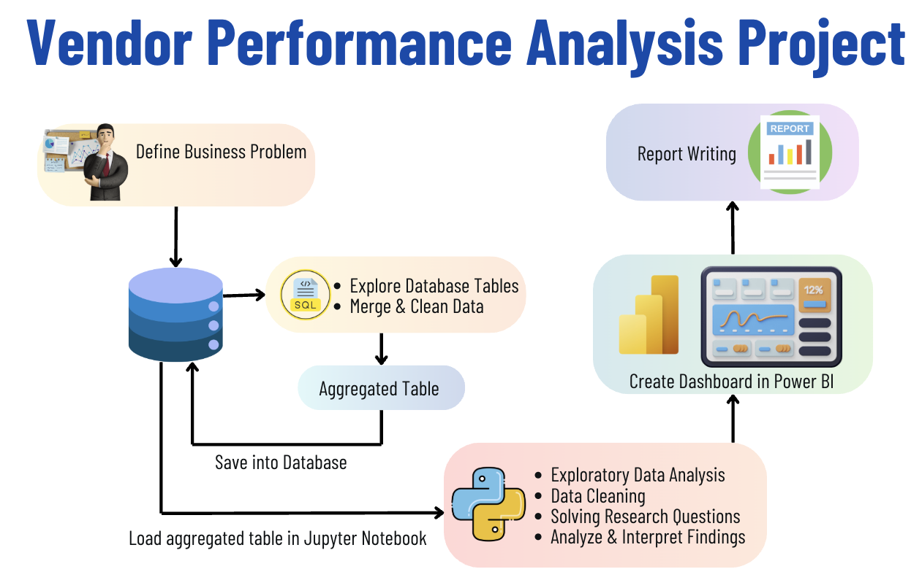

# 📊 Vendor Performance Analysis – Retail Inventory & Sales

> An end-to-end data analytics project that evaluates vendor efficiency, purchasing strategies, inventory turnover, and profitability using **SQL, Python, and Power BI** to support data-driven retail business decisions.


---

# 📌 Project Overview

Vendor performance plays a crucial role in maintaining a profitable and efficient retail supply chain. Businesses must continuously monitor vendor contributions, purchasing costs, inventory movement, and profit margins to make informed procurement decisions.

This project performs an **end-to-end Vendor Performance Analysis** using retail sales, inventory, and purchasing data. The complete analytical pipeline includes **SQL-based ETL**, **Python for data cleaning, exploratory data analysis (EDA), statistical testing**, and **Power BI dashboards** for interactive business reporting.

The objective is to uncover purchasing trends, identify underperforming vendors and brands, optimize inventory management, and provide actionable business recommendations.

---

# 🎯 Problem Statement

This project aims to answer important business questions related to vendor performance and inventory management, including:

- 📦 Which vendors contribute the highest sales and profits?
- 💰 Does bulk purchasing significantly reduce procurement costs?
- 📉 Which brands require promotional or pricing adjustments?
- 🏪 How much inventory remains unsold?
- 📊 Which vendors generate the highest profit margins?
- 📈 Are there statistically significant differences in vendor profitability?
- ⚠️ Is the business overly dependent on a small number of vendors?

---

# 💼 Business Questions Answered

This project investigates several business questions that help procurement teams and retail managers improve operational efficiency.

| Business Question | Objective |
|-------------------|-----------|
| 🏢 Which vendors contribute the most purchases? | Identify major vendors driving procurement. |
| 💰 Does buying in bulk reduce procurement costs? | Measure cost savings achieved through large purchase quantities. |
| 📦 Which brands require promotional strategies? | Detect brands with low sales but strong profit margins. |
| 📉 How much inventory remains unsold? | Identify slow-moving inventory affecting profitability. |
| 📊 Which vendors deliver the highest profit margins? | Compare vendor-level profitability. |
| 📈 Are vendor profit margins statistically different? | Validate differences using hypothesis testing. |
| ⚠️ Is procurement concentrated among a few vendors? | Measure vendor dependency and business risk. |

---

# 🎯 Expected Outcomes

By completing this analysis, the project aims to:

- Improve vendor selection strategies.
- Optimize procurement decisions.
- Reduce inventory holding costs.
- Identify opportunities for promotional campaigns.
- Detect procurement risks due to vendor dependency.
- Demonstrate practical SQL, Python, and Power BI skills through a real-world business case.

---

# ✨ Project Highlights

- 📊 Built a complete retail analytics pipeline using SQL, Python, and Power BI.
- 🧹 Performed extensive data cleaning and preprocessing.
- 🗄️ Designed SQL queries for ETL and vendor summary generation.
- 📈 Conducted Exploratory Data Analysis (EDA).
- 📉 Performed correlation analysis between business variables.
- 🧪 Applied statistical hypothesis testing using SciPy.
- 📊 Built an interactive Power BI dashboard for business reporting.
- 💡 Generated actionable recommendations for purchasing and inventory optimization.

---

# 🛠️ Tech Stack

- SQL
- Python
- Pandas
- Matplotlib
- Seaborn
- SciPy
- Power BI
- Jupyter Notebook
- Git & GitHub

---

# 📂 Project Structure

```text
vendor-performance-analysis/
│
├── README.md
├── .gitignore
├── requirements.txt
├── Vendor Performance Report.pdf
│
├── notebooks/
│   ├── exploratory_data_analysis.ipynb
│   └── vendor_performance_analysis.ipynb
│
├── scripts/
│   ├── ingestion_db.py
│   └── get_vendor_summary.py
│
├── dashboard/
│   └── vendor_performance_dashboard.pbix
│
├── data/
│   ├── sales.csv
│   ├── vendors.csv
│   └── inventory.csv
│
└── images/
    └── dashboard.png
```

---

# 📊 Dataset Information

The project uses multiple retail datasets containing purchasing, inventory, and sales information.

The datasets include information such as:

- Vendor Details
- Purchase Transactions
- Sales Transactions
- Inventory Levels
- Purchase Quantity
- Sales Quantity
- Freight Costs
- Gross Profit
- Profit Margin
- Purchase Price
- Sales Price

After ingestion, a consolidated **Vendor Summary Table** is generated for analysis.

---

# 🔄 Project Pipeline



---

# 🔍 Data Cleaning & Preparation

The following preprocessing steps were performed:

- Removed transactions where:
  - Gross Profit ≤ 0
  - Profit Margin ≤ 0
  - Sales Quantity = 0
- Converted columns into appropriate data types.
- Merged multiple datasets.
- Created vendor-level summary tables.
- Detected and handled outliers.
- Validated missing and inconsistent values.

---

# 📊 Exploratory Data Analysis (EDA)

The analysis focused on understanding retail purchasing and inventory behavior.

### Analyses Performed

- Vendor contribution analysis
- Brand performance analysis
- Inventory turnover analysis
- Bulk purchasing analysis
- Profitability analysis
- Freight cost analysis
- Correlation analysis
- Outlier detection
- Statistical hypothesis testing

---

# 📈 Visualizations

The project includes various visualizations such as:

- 📊 Bar Charts
- 📈 Line Charts
- 📉 Scatter Plots
- 📦 Box Plots
- 🔥 Correlation Heatmaps
- 📊 Vendor Performance Dashboard (Power BI)

---

# 💡 Key Insights

## 🏢 Vendor Dependency

- The **Top 10 vendors account for 65.69% of total purchases**, indicating a high dependency on a small group of suppliers.

---

## 💰 Bulk Purchasing

- Bulk purchasing reduces procurement cost by approximately **72% per unit**, demonstrating significant cost-saving opportunities.

---

## 📦 Inventory Turnover

- Around **$2.71 Million worth of inventory remains unsold**, highlighting slow-moving stock and inventory management challenges.

---

## 📉 Brand Performance

- **198 brands** have low sales but high profit margins, making them strong candidates for promotional campaigns.

---

## 📊 Correlation Analysis

- Purchase Quantity and Sales Quantity show an almost perfect positive correlation (**0.999**).
- Purchase Price has a weak relationship with overall profit.
- Profit Margin has a slight negative relationship with Sales Price.

---

## 🧪 Hypothesis Testing

Statistical analysis confirmed a **significant difference in vendor profit margins**, suggesting distinct pricing and purchasing strategies among vendor groups.

---

# 📊 Dashboard


The interactive Power BI dashboard provides insights into:

- Vendor-wise Sales
- Vendor Profitability
- Inventory Turnover
- Bulk Purchase Savings
- Purchase Distribution
- Performance Heatmaps
- Procurement KPIs

---

# 🚀 Getting Started

## Clone the Repository

```bash
git clone https://github.com/yourusername/vendor-performance-analysis.git
```

## Install Dependencies

```bash
pip install -r requirements.txt
```

## Run Data Ingestion

```bash
python scripts/ingestion_db.py
```

## Generate Vendor Summary

```bash
python scripts/get_vendor_summary.py
```

## Launch Jupyter Notebook

```bash
jupyter notebook
```

Open:

```
notebooks/exploratory_data_analysis.ipynb
```

and

```
notebooks/vendor_performance_analysis.ipynb
```

Finally, open:

```
dashboard/vendor_performance_dashboard.pbix
```

to explore the interactive dashboard.

---

# 📚 Skills Demonstrated

- SQL ETL
- Data Cleaning
- Data Preprocessing
- Exploratory Data Analysis (EDA)
- Business Analytics
- Data Visualization
- Correlation Analysis
- Hypothesis Testing
- Statistical Analysis
- Power BI Dashboard Development
- Inventory Analytics
- Procurement Analytics
- Business Insight Generation

---

# 💼 Business Recommendations

Based on the analysis, the following recommendations are proposed:

- Diversify the vendor base to reduce procurement risk.
- Increase bulk purchasing where cost savings are significant.
- Promote high-margin brands with low sales.
- Develop strategies to clear slow-moving inventory.
- Continuously monitor vendor performance using interactive dashboards.
- Optimize purchasing strategies based on vendor profitability.

---

# 👩‍💻 Author

**Latika Manoj Ray**

Aspiring Data Analyst | Python | SQL | Power BI | Data Visualization | Machine Learning

---

⭐ If you found this project useful, consider giving the repository a **Star**!